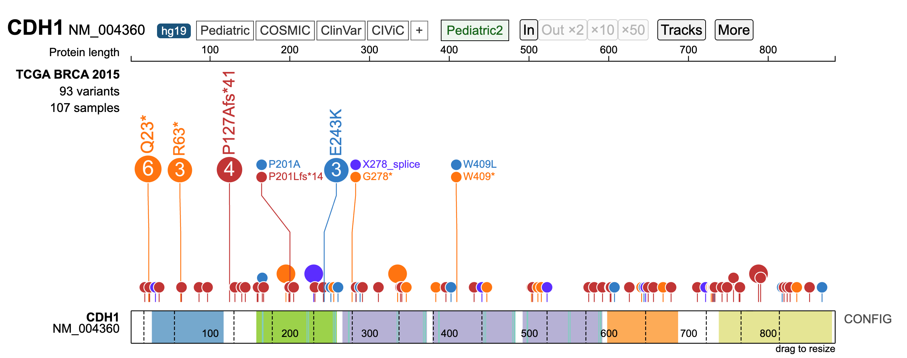

# 2025-05-29 - Mutation Data Visualization using ProteinPaint
Author: Osama Shiraz Shah<br>
Date: 2025-05-29


## Overview
This tutorial will guide you through the process of creating lollipop plots from mutation data using the [ProteinPaint](https://proteinpaint.stjude.org/) tool. You will learn how to programmatically retrieve mutation data from cBioPortal, reformat it in R, and subsequently input the reformatted mutation data into ProteinPaint to generate interactive lollipop plots suitable for scientific presentations and publications.

## Prerequisites: 
- **Basic familiarity with cBioPortal**: Ability to navigate and identify suitable studies with mutation data.
- **A working R environment**: R and RStudio (optional) installed and functional on your system.
- **Internet access**: Required to install necessary packages, download datasets from cBioPortal and access ProteinPaint website.

<br>

## Step 1: Install and Load `cbioportalR`
The following two R packages are required: 1) [dplyr](https://dplyr.tidyverse.org/) for data manipulation, and 2) [cbioportalR](https://cran.r-project.org/web/packages/cbioportalR/readme/README.html) for accessing and retrieving genomic datasets from [cBioPortal](https://www.cbioportal.org/). After installation, load both packages:
```r
## Install libraries
# install.packages("dplyr")
# install.packages("cbioportalR")
# Load libraries
library(dplyr)
library(cbioportalR)
```
## Step 2: Connecting to cBioPortal
Next, establish a connection to the public cBioPortal database and explore the available studies.
```r
# Set connection to public cBioPortal
set_cbioportal_db("public")

# Test connection
test_cbioportal_db()

# View available studies
available_studies <- available_studies()
head(available_studies)
```
## Step 3: Retrieve Mutation Data
In this tutorial, we utilize the TCGA breast cancer study by [Ciriello et al.](https://pubmed.ncbi.nlm.nih.gov/26451490/) (2015). The [cBioPortal page](https://www.cbioportal.org/study/summary?id=brca_tcga_pub2015) for this study is provided. We will use the unique study_id to programmatically retrieve mutation data (in MAF format), subset it for the _CDH1_ gene, and examine the mutation types.
```r
# Retrieve mutation data for CDH1 from TCGA Breast Cancer study
TCGA_BRCA_MAF <- get_mutations_by_study(study_id = "brca_tcga_pub2015")
TCGA_BRCA_CDH1_MAF <- subset(TCGA_BRCA_MAF, hugoGeneSymbol == "CDH1") %>% as.data.frame()

# View mutation types
table(as.character(TCGA_BRCA_CDH1_MAF$mutationType))
```
## Step 4: Make Mutation Names Compatible with ProteinPaint
Next, convert the MAF mutation type names to those recognized by ProteinPaint. This process involves two steps: first, mapping mutation names from MAF to ProteinPaint-supported formats; second, converting these names to the corresponding symbols using a mapping list between mutation names and ProteinPaint-recognized symbols.
```r
# Convert MAF mutation types names to ProteinPaint recognized names
TCGA_BRCA_CDH1_MAF$MUT_protein_paint <- ifelse(
  as.character(TCGA_BRCA_CDH1_MAF$mutationType) %in% c("Frame_Shift_Del", "Frame_Shift_Ins", "In_Frame_Del"), "FRAMESHIFT",
  ifelse(as.character(TCGA_BRCA_CDH1_MAF$mutationType) == "Missense_Mutation", "MISSENSE",
    ifelse(as.character(TCGA_BRCA_CDH1_MAF$mutationType) == "Nonsense_Mutation", "NONSENSE",
      ifelse(as.character(TCGA_BRCA_CDH1_MAF$mutationType) == "Splice_Site", "SPLICE", "NA")
    )
  )
)

# Define mutation type name-symbol dictionary as described in https://proteinpaint.stjude.org/
mutation_symbol_dict <- list(
  MISSENSE = "M",
  EXON = "E",
  FRAMESHIFT = "F",
  NONSENSE = "N",
  SILENT = "S",
  PROTEINDEL = "D",
  PROTEININS = "I",
  PROTEINALTERING = "ProteinAltering",
  SPLICE_REGION = "P",
  SPLICE = "L",
  INTRON = "Intron",
  `Not tested` = "Blank",
  Wildtype = "WT",
  UTR_3 = "Utr3",
  UTR_5 = "Utr5",
  NONSTANDARD = "X",
  NONCODING = "noncoding",
  SNV = "snv",
  MNV = "mnv",
  `Sequence insertion` = "insertion",
  `Sequence deletion` = "deletion"
)

# Map ProteinPaint mutations to symbols  
TCGA_BRCA_CDH1_MAF$MUT_protein_paint_class <- unlist(mutation_symbol_dict[TCGA_BRCA_CDH1_MAF$MUT_protein_paint])
```
## Step 5: Save Data in Format Compatible with ProteinPaint
ProteinPaint requires mutation input in the following format: mutation type name, genomic position, mutation type symbol, and optionally, sample identifier. The output file contains one mutation per line, with fields separated by tabs.
```r
# Format for output
TCGA_CDH1_protein_paint <- paste0(
  TCGA_BRCA_CDH1_MAF$proteinChange, ", ",
  "chr", TCGA_BRCA_CDH1_MAF$chr, ":", TCGA_BRCA_CDH1_MAF$startPosition, ", ",
  TCGA_BRCA_CDH1_MAF$MUT_protein_paint_class, ", ", TCGA_BRCA_CDH1_MAF$sampleId
)

# Export to tab-delimited file
write.table(
  x = TCGA_CDH1_protein_paint,
  file = "TCGA_BRCA_CDH1_protein_paint.txt",
  col.names = FALSE,
  row.names = FALSE,
  quote = FALSE,
  sep = "\t"
)
```
You can also download the saved output file from this link: [TCGA_BRCA_CDH1_protein_paint.txt](./TCGA_BRCA_CDH1_protein_paint.txt)

## Step 5: Visualize Mutation Data on ProteinPaint
Video tutorial on inputting mutation files to [ProteinPaint](https://proteinpaint.stjude.org/) to generate lollipop plots.
[](https://www.youtube.com/watch?v=_Bin_jZBcss)


<br>


## Output

> Higher quality outputs can be generated from the app website by going into 'More' options and exporting plot as svg using 'Export SVG' option.


<br>


---

For questions or suggestions, feel free to open an issue or pull request! You can also contact us at [bionbytes]@[gmail.com]. This tutorial is released under the MIT License.


